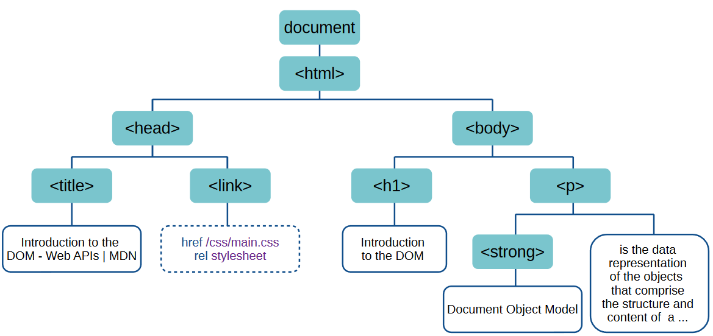
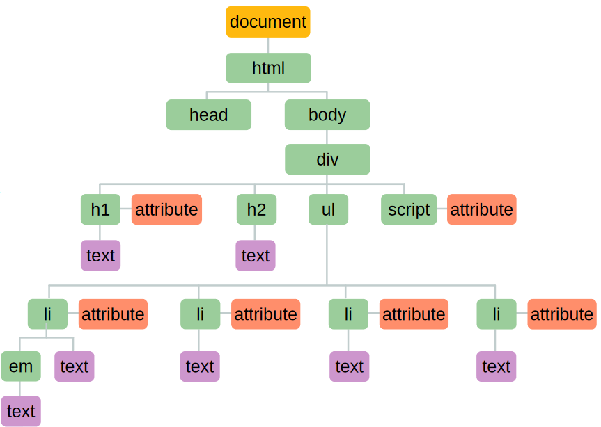
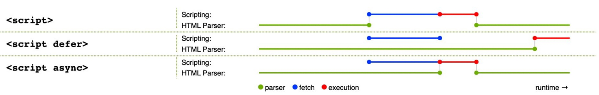

# Objects

## Creating objects

#### Literal notation
The object is created first and then the properties and methods are added to it. 

```js
let hotel = {}; // creates an empty
object
// adds properties to the object
hotel.name = 'Thon';
hotel.rooms = 40;
hotel.booked = 25;
// adds a method to the object
hotel.checkAvailability = function() {
    return this.rooms -this.booked;
};
```

#### Object constructor notation
Another way of creating objects is thorugh constructors as shown in the code below.

This is old syntax, and should **not** be used, if you care about your grade:
```js
function Resturant(name, seats, food) {
    this.name = name;
    this.seats = seats;
    this.food = food;
}

let resturant1 = new Resturant('Burgerian - Juicy Burgers', 104, 'Burger');
let resturant2 = new Resturant('Saladcorner', 20, 'Salad');
```

Make it as an class instead like this:
```js
class Hotel{
    constructor(name, rooms, booked) {
        this.name = name;
        this.rooms = rooms;
        this.booked = booked;
    }

    checkAvailability() {
        return this.rooms - this.booked;
    }
}
```

## Modifying objects
#### Dot vs. bracket notation
Dot notation only allows **static keys**, while bracket notation accepts **dynamic keys** (property names evaluated from an expression during runtime).

#### Deleting properties
The delete keyword is used to delete an object: `delete hotel.name;`. If you just want to clear the *value* of a property, do it like this `hotel.name = '';`.

## Built-in objects
#### Browser Object Model
Group of objects that represent the current browser window or tab. It contains objects that model things like browser history and device screen.

Useful `window` properties:
- `window.innerHeight` and `window.innerWidth`, which natuarally gives the height/width of the viewport.

Useful `window` methods:
- `window.alert()` creates a dialog box with messages for user
- `window.open()` opens new window with the URL specified as a parameter
- `window.print()` tells the browser that the user wants to print the contents of the current page

Useful `window` child objects:
- `window.location` gets/sets the location (current URL) of the window object
- `window.document` returns a reference to the document contained in the window
- `window.history` returns a reference to the history of the object
- `window.screen` returns a reference to the object assosiated with the window

#### Document Object Model
Group of objects that represent the current page, with the document object as root. Creates a new object for each HTML element, as well as each individual section of text, within the page.



Every object in the DOM tree is referred to as a DOM node. Each node is a object with methods and properties. Types of node:
- document
- element
- attribute
- text



Useful DOM methods:
- `document.write(markup)`, where markup can also be plain text
- `querySelector()` returns the **first** element within the document that macthes the specified selector, or group of selectors.
- `querySelectorAll()` returns **all** element within the document that matches the specified selector, or group of selectors.
- `document.createElement(tagName)`
- `document.createTextNode(data)`

***NOTE!** Don't use the old `getElementBy*()` if you care about you grade!*

Useful DOM properties:
- `document.title`
- `document.lastModified` gives the date on which the document was last modified
- `document.URL`

#### Global JavaScript objects
Induvidial objects that serve different purposes in the JavaScript language. 

Examples of built-in objects are:
- String
- number
- Date
- Math


# Classes
Classes are a set of objects that inherit properties from the same prototype object, which means the instances of objects are of the same class.

# Events
Events are fired by the web browser whenever something happens to the document/browser/some element/object etc. In JS we can register functions to be triggered when an event occurs.

## Event model
Events are *fired* (or *raised*) when the user clicks on f.ex a "read more..." link, which will fire a **click** event. Events *trigger* functions registered to it.

Event type is a string that specifies what kind of event occured. Some types are:
- mousedown
- keydown
- load

The event target is the object on which the event occurred / is associated with. This may be on window, document, element object or any element within an HTML document.

Event handler (or *listener*) is a function that handles or responds to an event. They are registered by specifying an *event type* and *event target*. When an event of the specified type occurs on the specified target, the browser *invokes* the handler function.

## Restering event handlers

#### Setting event handler properties
This is a traditional way of doing it:
```js
element.onevent = functionName;
```
- **element** is the target element in the DOM.
- **onevent** is the event that occurs, preceded by "on"
- **functionName** is the handler function. Remember to not use parantesis here.

Code example:
```js
function checkUsername() {
    // Check username
}

let el = document.querySelector('#username');
el.onblur = checkUsername;
```

#### Registering event handler with addEventListener()
I find this way of registering events better. It is done this way:
```js
element.addEventListener('event', functionName);
```

Example with different type of functions:
```js
// NOTE! By regestering new event handler to the same target AND same event, the preveious handler is overwritten!
let el = document.querySelector('#username');

// named function
function checkUsername() {
    // Code to check the length of the username
}
el.addEventListener('blur', checkUsername);

// anonymous function
el.addEventListener('blur', function() {
    // Function code
})

// arrow function
el.addEventListener('blur', () => {
    // Function code
})
```

#### Removing event handlers
Event handlers can be removed with `element.removeEventListener('event', handlerFunction)`.

## Event object
When an event occurs the *event object* contains information about the event, such as:
- which element the event happened upon
- which key was pressed for a 'keypress' event
- what part of the viewport the user clicked for a 'click' event

# JS timeline

## defer vs. async


# Browser APIs

## localStorage
Key characteristics:
- data is stored permanently
- it does not expire and remains stored on the user's device until the application deletes it or the user asks the browser to delete it
- useful for saving preferences or settings

## sessionStorage
Key characteristics:
- is deleted when the window or tab are closed
- if the user has two browser tabs displaying documents from the same origin, those two tabs have separate sessionStorage data